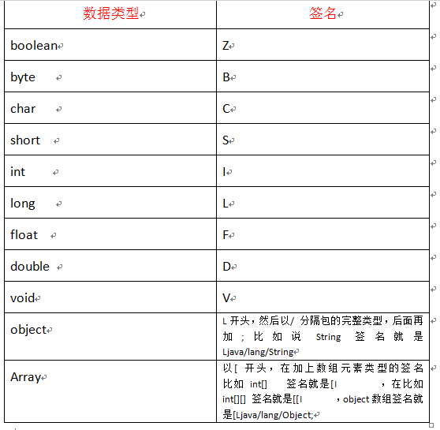

# Android-API-Security
Android API Security(.so)，安卓APP/API安全加密so库，防二次打包，防API签名破解

## 接入步骤

* 第一步：修改 app/src/main/cpp/apisecurity-lib.cpp 文件中的内容

```c++
//此处改为你的APP签名
#define SHA1 "a8e3d91a4f77dd7ccb8d43ee5046a4b6833f4785"
//此处改为你的APP包名
#define APP_PKG "cn.android.sample"
//此处改为你的application全名  没有就是android.app.Application
#define APPLICATION_NAME "android.app.Application"
//此处填写API盐值
#define API_SECRET "ABC"
```

* 第二步：修改 app/build.gradle 文件中的签名(测试需要，非必须)

```groovy
 signingConfigs {
        release {
            keyAlias 'wzbos'
            keyPassword '123456'
            storeFile file("test.keystore")
            storePassword '123456'
        }
    }
```

* 第三步：拷贝 app/build/intermediates/cmake/release/obj 文件夹下的.so文件到你的项目中libs文件夹中


## 依赖方式

在module级的build.gradle文件中加入以下代码

``` gradle

    sourceSets {
        main {
           jniLibs.srcDir 'libs'
        }
    }

    implementation project(":apisecurity")
```


## 调用示例

``` java
 //初始化
 APISecurity.init(context);
 //计算签名
 String val = "POST https://www.xxx.com/login?id=1&pwd=xxx......";
 String sign = APISecurity.sign(aptStr)
```
 App.hook(context);//hook签名验证
//在这里 重置PackageManager 只要在验证前重置即可
 // AppSigning.resetPackageManager(getBaseContext());再hook之后 验证签名之前重置即可 获取真实签名

 APISecurity.init(this)//验证三步走
 1.验证签名是否符合自己预设
 2.验证包名
 3验证apk源文件签名信息



过以下命令就可以拿到指定类的所有属性、方法的签名了，很方便有木有？！
javap -s -p 完整类名
descriptor就是我们需要的签名了，注意签名中末尾的分号不能省略
方法签名的规律就是，括号不可以省略：
(参数类型签名)返回值类型签名
C/C++访问Java的属性、方法
有以下几种情况：

访问Java类的非静态属性。

访问Java类的静态属性。

访问Java类的非静态方法。

访问Java类的静态方法。

间接访问Java类的父类的方法。

访问Java类的构造方法。

一、访问Java的非静态属性
Java方法中，通过调用accessField，利用C修改静态属性

public String str = "Li lu";

//访问非静态属性str，修改它的值
public native void accessField();
C代码如下：（头文件可以不写，直接写实现）

JNIEXPORT void JNICALL Java_com_test_JniTest_accessField
(JNIEnv * env, jobject jobj){

    //通过对象拿到Class
    jclass clz = (*env)->GetObjectClass(env, jobj);
    //拿到对应属性的ID
    jfieldID fid = (*env)->GetFieldID(env, clz, "str", "Ljava/lang/String;");
    //通过属性ID拿到属性的值
    jstring jstr = (*env)->GetObjectField(env, jobj, fid);

    //通过Java字符串拿到C字符串，第三个参数是一个出参，用来告诉我们GetStringUTFChars内部是否复制了一份字符串
    //如果没有复制，那么出参为isCopy，这时候就不能修改字符串的值了，因为Java中常量池中的字符串是不允许修改的（但是jstr可以指向另外一个字符串）
    char* cstr = (*env)->GetStringUTFChars(env, jstr, NULL);
    //在C层修改这个属性的值
    char res[20] = "I love you : ";
    strcat(res, cstr);

    //重新生成Java的字符串，并且设置给对应的属性
    jstring jstr_new = (*env)->NewStringUTF(env, res);
    (*env)->SetObjectField(env, jobj, fid, jstr_new);

    //最后释放资源，通知垃圾回收器来回收
    //良好的习惯就是，每次GetStringUTFChars，结束的时候都有一个ReleaseStringUTFChars与之呼应
    (*env)->ReleaseStringUTFChars(env, jstr, cstr);
}
最后在Java中测试：

public static void main(String[] args) {

    JniTest test = new JniTest();
    System.out.println(test.str);
    //修改非静态属性str
    test.accessField();
    System.out.println(test.str);

}
二、访问Java的静态属性
Java代码如下：

//访问静态属性NUM，修改它的值
public static int NUM = 1;

public native void accessStaticField();
C代码如下：

JNIEXPORT void JNICALL Java_com_test_JniTest_accessStaticField
(JNIEnv * env, jobject jobj){
    //与上面类似，只不过是某些方法需要加上Static
    jclass clz = (*env)->GetObjectClass(env, jobj);
    jfieldID fid = (*env)->GetStaticFieldID(env, clz, "NUM", "I");
    jint jInt = (*env)->GetStaticIntField(env, clz, fid);
    jInt++;
    (*env)->SetStaticIntField(env, clz, fid, jInt);
}
最后在Java中测试：

public static void main(String[] args) {

    JniTest test = new JniTest();
    System.out.println(NUM);
    test.accessStaticField();
    System.out.println(NUM);

}
三、访问Java的非静态方法
Java代码如下，通过调用accessMethod，在底层用C语言调用genRandomInt方法

//产生指定范围的随机数
public int genRandomInt(int max){
    System.out.println("genRandomInt 执行了...max = "+ max);
    return new Random().nextInt(max);
}

public native void accessMethod();
C代码如下：

JNIEXPORT void JNICALL Java_com_test_JniTest_accessMethod
(JNIEnv * env, jobject jobj){
    jclass clz = (*env)->GetObjectClass(env, jobj);
    //拿到方法的ID，最后一个参数是方法的签名
    jmethodID mid = (*env)->GetMethodID(env, clz, "genRandomInt", "(I)I");
    //调用该方法，最后一个是可变参数，就是调用该方法所传入的参数
    //套路是如果返回是：Call返回类型Method
    jint jInt = (*env)->CallIntMethod(env, jobj, mid, 100);
    printf("output from C ： %d", jInt);
}
最后在Java中测试：

public static void main(String[] args) {

    JniTest test = new JniTest();
    test.accessMethod();

}
四、访问Java的静态方法
Java代码如下，通过调用accessStaticMethod，在底层用C语言调用getUUID方法

public native void accessStaticMethod();

//产生UUID字符串
public static String getUUID(){
    System.out.println("getUUID 执行了...");
    return UUID.randomUUID().toString();
}
C代码如下：

JNIEXPORT void JNICALL Java_com_test_JniTest_accessStaticMethod
(JNIEnv * env, jobject jobj){
    jclass clz = (*env)->GetObjectClass(env, jobj);
    jmethodID mid = (*env)->GetStaticMethodID(env, clz, "getUUID", "()Ljava/lang/String;");

    //调用java的静态方法，拿到返回值
    jstring jstr = (*env)->CallStaticObjectMethod(env, clz, mid);

    //把拿到的Java字符串转换为C的字符串
    char* cstr= (*env)->GetStringUTFChars(env, jstr, NULL);

    //后续操作，产生以UUID为文件名的文件
    char fielName[100];
    sprintf(fielName, "D:\\%s.txt", cstr);
    FILE* f = fopen(fielName, "w");
    fputs(cstr, f);
    fclose(f);

    printf("output from C : File had saved", jstr);
}
最后在Java中测试：

public static void main(String[] args) {

    JniTest test = new JniTest();
    test.accessStaticMethod();

}
五、间接访问Java类的父类的方法
Java代码如下：

父类：

package com.test;

public class Human {
    protected void speek() {
        System.out.println("Human Speek");
    }
}
子类：

package com.test;

public class Man extends Human {
    @Override
    protected void speek() {
        // 可以通过super关键字来访问父类的方法
        // super.speek();
        System.out.println("Man Speek");
    }
}
在TestJni类中有Human属性：

//父类的引用指向子类的对象
Human man= new Man();

public native void accessNonvirtualMethod();
如果是直接使用man.speek()的话，访问的是子类Man的方法
但是通过底层C的方式可以间接访问到父类Human的方法，跳过子类的实现，甚至你可以直接哪个父类（如果父类有多个的话），这是Java做不到的。

下面是C代码实现，无非就是属性和方法的访问：

JNIEXPORT void JNICALL Java_com_test_JniTest_accessNonvirtualMethod
(JNIEnv * env, jobject jobj){
    //先拿到属性man
    jclass clz=(*env)->GetObjectClass(env, jobj);
    jfieldID fid = (*env)->GetFieldID(env, clz, "man", "Lcom/test/Human;");
    jobject man = (*env)->GetObjectField(env, jobj, fid);

    //拿到父类的类，以及speek的方法id
    jclass clz_human = (*env)->FindClass(env, "com/test/Human");
    jmethodID mid = (*env)->GetMethodID(env, clz_human, "speek", "()V");

    //调用自己的speek实现
    (*env)->CallVoidMethod(env, man, mid);
    //调用父类的speek实现
    (*env)->CallNonvirtualVoidMethod(env, man, clz_human, mid);
}
当有这个类的对象的时候，使用(*env)->GetObjectClass()，相当于Java中的test.getClass()

当有没有这个类的对象的时候，(*env)->FindClass()，相当于Java中的Class.forName("com.test.TestJni")

这里直接使用CallVoidMethod，虽然传进去的是父类的Method ID，但是访问的让然是子类的实现。

最后，通过CallNonvirtualVoidMethod，访问不覆盖的父类方法（C++使用virtual关键字来覆盖父类的实现），当然你也可以指定哪个父类（如果有多个父类的话）。

最后在Java中测试：

public static void main(String[] args) {

    JniTest test = new JniTest();
    //这时候是调用子类Man的方法
    test.man.speek();
    //但是通过JNI的方式，可以访问到父类的speek方法
    test.accessNonvirtualMethod();

}
六、访问Java类的构造方法
Java代码如下，通过调用accessConstructor，在底层用C语言调用java.util.Date产生一个当前的时间戳，并且返回。

//调用Date的构造函数
public native long accessConstructor();
C代码如下：

JNIEXPORT jlong JNICALL Java_com_test_JniTest_accessConstructor
(JNIEnv * env, jobject jobj){

    jclass clz_date = (*env)->FindClass(env, "java/util/Date");
    //构造方法的函数名的格式是：<init>
    //不能写类名，因为构造方法函数名都一样区分不了，只能通过参数列表（签名）区分
    jmethodID mid_Date = (*env)->GetMethodID(env, clz_date, "<init>", "()V");;

    //调用构造函数
    jobject date = (*env)->NewObject(env, clz_date, mid_Date);

    //注意签名，返回值long的属性签名是J
    jmethodID mid_getTime= (*env)->GetMethodID(env, clz_date, "getTime", "()J");
    //调用getTime方法
    jlong jtime = (*env)->CallLongMethod(env, date, mid_getTime);

    return jtime;
}
最后在Java中测试：

public static void main(String[] args) {

    JniTest test = new JniTest();
    //直接在Java中构造Date然后调用getTime
    Date date = new Date();
    System.out.println(date.getTime());
    //通过C语音构造Date然后调用getTime
    long time = test.accessConstructor();
    System.out.println(time);

}
总结
属性、方法的访问的使用是和Java的反射API类似的。

综合进阶案例——JNI返回中文乱码问题
测试乱码问题：

public native void testChineseIn(String chinese);//传进去
public native String testChineseOut();//取出来会乱码

public static void main(String[] args) {

    //传中文进去，然后转为C字符串，直接在C层输出是没有问题的
    JniTest test = new JniTest();
    test.testChineseIn("我爱你");
    //C层将C字符串转换为JavaString然后输出，就会乱码
    System.out.println(test.testChineseOut());

}
C代码如下：

JNIEXPORT void JNICALL Java_com_test_JniTest_testChineseIn
(JNIEnv * env, jobject jobj, jstring chinese){

    char* c_chinese = (*env)->GetStringUTFChars(env, chinese, NULL);
    printf("%s", c_chinese);
}

JNIEXPORT jstring JNICALL Java_com_test_JniTest_testChineseOut
(JNIEnv * env, jobject jobj){

    char* c_str = "我爱你";
    jstring j_str = (*env)->NewStringUTF(env, c_str);
    return j_str;
}
结果输出，其中第一条是C返回的乱码，第二条是传进去在C层打印的结果：

ÎҰ®Ä
我爱你
可以看到C执行的速度要比Java快。
原因分析，调用NewStringUTF的时候，产生的是UTF-16的字符串，但是我们需要的时候UTF-8字符串。
解决办法，通过Java的String类的构造方法来进行字符集变换。

JNIEXPORT jstring JNICALL Java_com_test_JniTest_testChineseOut
(JNIEnv * env, jobject jobj){

    //需要返回的字符串
    char* c_str = "我爱你";
    //jstring j_str = (*env)->NewStringUTF(env, c_str);

    //通过调用构造方法String string = new String(byte[], charsetName);来解决乱码问题

    //0.找到String类
    jclass clz_String =  (*env)->FindClass(env, "java/lang/String");
    jmethodID mid = (*env)->GetMethodID(env, clz_String, "<init>", "([BLjava/lang/String;)V");

    //准备new String的参数：byte数组以及字符集
    //1.创建字节数组，并且将C的字符串拷贝进去
    jbyteArray j_byteArray = (*env)->NewByteArray(env, strlen(c_str));
    (*env)->SetByteArrayRegion(env, j_byteArray, 0, strlen(c_str), c_str);
    //2.创建字符集的参数，这里用Windows的more字符集GB2312
    jstring charsetName = (*env)->NewStringUTF(env, "GB2312");

    //调用
    jstring j_new_str = (*env)->NewObject(env, clz_String, mid, j_byteArray, charsetName);
    return j_new_str;

}
原文链接：http://www.apkbus.com/blog-0-65619.html


 // 获取jdk位数
        String bits = System.getProperty("sun.arch.data.model");
        String ver = System.getProperty("ro.build.version.sdk");
        // 获取os名称
        String ops = System.getProperty("os.name");
        logger.info("jdk bits=" + bits);
        logger.info("option sysetm=" + ops);
Build.VERSION.SDK_INT > Build.VERSION_CODES.Q
SystemProperties.getInt("ro.build.version.sdk", 0);


###C++代码取Android系统版本号：
```
#include <jni.h>
#include <string>

#include <sys/system_properties.h>

// 日志打印
#include <android/log.h>
#define LOG_TAG "TAG_LOG"
#define LOGI(...) __android_log_print(ANDROID_LOG_INFO, LOG_TAG, __VA_ARGS__)

versionI() {
    // 1. 获取 SDK 版本号 , 存储于 C 字符串 sdk_verison_str 中
    char sdk[128] = "0";

    // 获取版本号方法
    __system_property_get("ro.build.version.sdk", sdk);

    //将版本号转为 int 值
    int sdk_verison = atoi(sdk);
}

 # begin build properties （开始设置系统性能）
 # autogenerated （通过设置形成系统信息）
 ro.=GRI40 (版本ID)
 ro.build.=GRJ22 （版本号）
 ro.build.version.incremental=eng.buildbot.20110619.060228 （版本增量）
 ro.build.version.sdk=10 （sdk版本）
 ro.build.version.codename=REL （版本代号）
 ro.build.version.release=2.3.4 （Android 2.3.4系统）
 ro.build.date=Sun Jun 19 06:02:58 UTC 2011 （制作者及制作时间）
 ro.build.date.utc=0
 ro.build.type=user (编译模式,如user,userdebug,eng,test模式)
 ro.build.user=buildbot (编译账户)
 ro.build.host=bb1 (编译主机系统)
 ro.build.tags=test-keys (编译标签)
 ro.product.model=HTC Wildfire （HTC内部手机代号）
 ro.product.brand=htc_wwe （手机品牌）
 ro.product.name=htc_buzz （手机正式名称）
 ro.product.device=buzz （采用的设备）
 ro.product.board=buzz （采用的处理器）
 ro.product.cpu.abi=armeabi-v6j （cpu的版本）
 ro.product.cpu.abi2=armeabi （cpu的品牌）
 ro.product.manufacturer=HTC （手机制造商）
 ro.product.locale.language=zh （手机默认语言）
 ro.product.locale.region=CN （地区语言）
 ro.wifi.channels= （WIFI连接的渠道）
 ro.board.platform=msm7k （主板平台）
 # ro.build.product is obsolete; use ro.product.device （旧代码ro.build.product，使用代码ro.product.device）
 ro.build.product=buzz （建立产品）
 # Do not try to parse ro.build.description or .fingerprint （不要试图修改description和fingerprint）
 ro.build.description=passion-user 2.3.3 GRI40 102588 release-keys （用户的KEY）
 ro.build.fingerprint=google/passion/passion:2.3.3/GRI40/102588:user/release-keys （系统指纹）
 # end build properties （性能代码完毕）
 #
 # system.prop for buzz （系统技术支持由BUZZ提供）
 #
 # Density in DPI of the LCD of this board. This is used to scale the UI （高密度的液晶的DPI板。这是用来大规模UI的）
 # appropriately. If this property is not defined, the default value is 160 dpi. （appropriately.如果这个属性没有定义,缺省值是160 dpi的分辨率）
 ro.sf.lcd_density=240 （显示屏分辨率，数值越大分辨率越底，240就是800*480的）
 # View configuration for QVGA. （屏幕的设置）
 view.fading_edge_length=8
 view.touch_slop=15 （触摸屏灵敏度，数值越大越灵敏）
 view.minimum_fling_velocity=25 （滑动速度）
 view.scroll_friction=0.008 （滑动误差）
 # RIL specific configuration. （特定设置）
 rild.libpath=/system/lib/libhtc_
 ro.ril.ecc.HTC-WWE=999
 ro.ril.ecc.HTC-ELL=92,93,94
 ro.ril.enable.a52.HTC-ITA=1
 ro.ril.enable.a53.HTC-ITA=1
 ro.ril.enable.a52=0
 ro.ril.enable.a53=1
 ro.ril.vmail.23415=1571,BT
 ro.ril.hsdpa.category=8 （hsdpa全称High Speed Downlink Packet Access中文意思：高速下行分组接入,设置的数越大传输越快）
 ro.ril.htcmaskw1.bitmask=429496
 ro.ril.htcmaskw1=14449
 ro.ril.def.agps.mode=2 （打开AGPS服务支持，可改为ro.ril.def.agps.mode=0 改后能省电但GPS定位速度会变慢）
 ro.ril.gprsclass=12 （GPRS设置）
 # For HSDPA low throughput （HSDPA低输量）
 ro.ril.disable.power.collapse=1 （关闭电源）
 # Modify MMS APN retry timer from 5s to 2s. （修改短信的APN设置5秒为2秒）
 ro.gsm.2nd_data_retry_config=max_retries=3, 2000, 2000, 2000
 # Time between scans in seconds. Keep it high to minimize battery drain.（扫描在几秒之内，可降低用电量）
 # This only affects the case in which there are remembered access points, （这个修改仅能影响此文件）
 # but none are in range.（但是没有一项是在范围内的）
 wifi.interface=eth0 （WIFI界面）
 wifi.supplicant_scan_interval=45 （WIFI扫描间隔时间，这里设置是45秒。把这个时间设置长点能省电）
 # Mobile data interfaces （移动数据的接口）
 mobiledata.interfaces=rmnet0,rmnet1,rmnet2
 # Allow or deny tethering. （允许和拒绝绑定）
 ro.tether.denied=false
 # Default network type. （默认的网络类型）
 # 0 => WCDMA Preferred. （0=WCDMA优先）
 ro.telephony.default_network=0
 # Enable Google-specific location features, （谷歌特定地点的设置）
 # like NetworkLocationProvider and LocationCollector.（如网络服务器提供商和服务器位置）
 ro.c o m.google.locationfeatures=1
 # The OpenGL ES API level that is natively supported by this device. （开放式绘图介面）
 # This is a 16.16 fixed point number. （界面有16个点，16个不动点数量）
 ro.opengles.version=65536 （开放式绘图介面参数）
 # Disable fs check on boot by default. （开机时默认禁用FS检查）
 sys.checkfs.fat=false
 # Performance settings. （性能设置）
 dalvik.vm.execution-mode=int:jit
 dalvik.vm.heapsize=24m （虚拟内存大小，可设置为16m或24m或32m或48m）
 persist.sys.use_dithering=1
 persist.sys.purgeable_assets=1
 # Increase SKIA decode memory capability for progressive jpg file.
 ro.media.dec.jpeg.memcap=20000000
 #
 # ADDITIONAL_BUILD_PROPERTIES （其他性能设置）
 no_require_sim=true （手机卡保护设置）
 ro.rommanager.developerid=cyanogenmodnightly （固件管理器开发者是CM大神）
 ro.url.legal=http://www./intl/%s/mobile/android/basic/phone-legal.html
 ro.url.legal.android_privacy=http://www]/intl/%s/mobile/android/basic/privacy.html
 ro. com.google.clientidbase=android-google （谷歌客户身份）
 ro. com.android.wifi-watchlist=GoogleGuest （WIFI用户名单）
 ro.setupwizard.enterprise_mode=1 （默认情景模式）
 ro. com.android.dateformat=MM-dd-yyyy （默认时间格式，改为yyyy-MM-dd，显示效果就是XXXX年XX月XX日）
 ro. com.android.dataroaming=false （漫游设置）
 ro.config.ringtone=Playa.ogg （默认铃声设置，文件在/system/media/audio/ringtones 把喜欢的铃声放这里，比如123. MP3放入ringtones文件夹中，这里代码改为ro.config.ringtone=123. mp3）
 ro.config.notification_sound=regulus.ogg （默认提示音，文件在/system/media/audio/notifications 修改方法同上）
 ro.config.alarm_alert=Alarm_Beep_03.ogg （默认闹铃，文件在/system/media/audio/alarms 修改方法同上）
 ro.modversion=CyanogenMod-7-06192011-NIGHTLY-buzz （版本信息，改这个能让你大名出现系统关于中，改为ro.modversion=xxxxx）
 ro.setupwizard.mode=OPTIONAL （安装向导模式）
 net. bt. name=Android （系统名称）
 dalvik.vm.stack-trace-file=/data/anr/traces.txt
```

Class.newInstance()；只能反射无参的构造器，需要构造器可见；
Constructor.newInstance()；可以反射任何构造器，可以反射私有构造器

```
public class Student {
    private String name;
    private int age;
    private double score;

    public Student() {}
    private Student(String name, int age, double score) {
        this.name = name;
        this.age = age;
        this.score = score;
    }
}
```
```
public class Client {
    public static void main(String[] args) throws Exception {
        Class clazz = Student.class;
        //利用Class.newInstance()
        Object object1 = clazz.newInstance();
        System.out.println(object1);
        //利用Constructor.newInstance()反射无参构造方法
        Constructor cons1 = clazz.getDeclaredConstructor();
        Object object2 = cons1.newInstance();
        //利用Constructor.newInstance()反射私有构造方法
        Constructor cons2 = clazz.getDeclaredConstructor(String.class,Integer.TYPE,Double.TYPE);
        if(!cons2.isAccessible())
            cons2.setAccessible(true);
        Object object3 = cons2.newInstance("张三",12,88.5);
    }
}

```
Java除了这两这种方法创建对象外，还有三个方式，使用new 关键字，使用对象克隆clone()方法，以及使用反序列化（ObjectInputStream）的 readObject() 方法。

使用 clone()方法：类必须实现Cloneable接口，并重写其clone()方法
使用反序列化ObjectInputStream 的readObject()方法：类必须实现 Serializable接口
```
public class Student implements Serializable,Cloneable{
    private static final long serialVersionUID = -2263090506226622866L;

    private String name;

    @Override
    protected Object clone() throws CloneNotSupportedException {
        return super.clone();
    }

    @Override
    public boolean equals(Object o) {
        if (this == o) return true;
        if (o == null || getClass() != o.getClass()) return false;

        Student student = (Student) o;

        return name != null ? name.equals(student.name) : student.name == null;
    }

    @Override
    public int hashCode() {
        return name != null ? name.hashCode() : 0;
    }
}

public class Client {
    public static void main(String[] args) throws Exception {
        //使用new关键字创建对象
        Student student1 = new Student();

        //使用clone()方法：类必须实现Cloneable接口，并重写其clone()方法
        Student student2 = (Student) student1.clone();

        // 使用 反序列化ObjectInputStream的readObject()方法：类必须实现 Serializable接口
        // 序列化
        ObjectOutputStream objectOutputStream = new ObjectOutputStream(new FileOutputStream("test.txt"));
        objectOutputStream.writeObject(student1);
        // 反序列化
        ObjectInputStream objectInputStream = new ObjectInputStream(new FileInputStream("test.txt"));
        Student student3 = (Student) objectInputStream.readObject();
    }
}
```
记得之前写过一篇 单例模式 的博客，其中最后就提到序列化也会破坏单例，就是因为反序列化会创建新的对象，所以我们在单例模式中要有readResolve()方法。